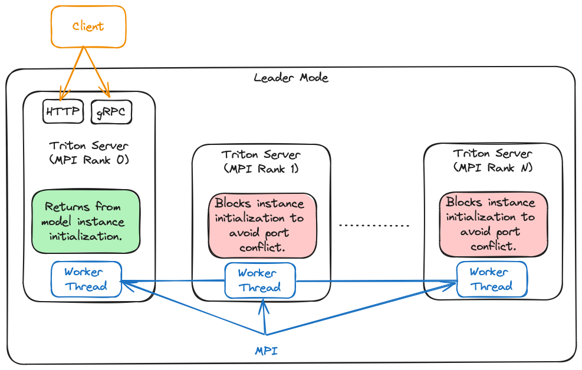
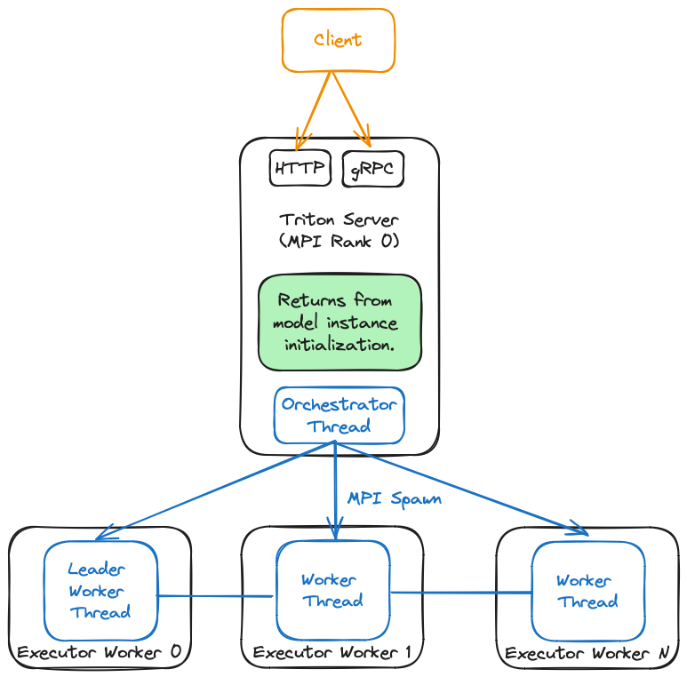

<!--
# Copyright 2024, NVIDIA CORPORATION & AFFILIATES. All rights reserved.
#
# Redistribution and use in source and binary forms, with or without
# modification, are permitted provided that the following conditions
# are met:
#  * Redistributions of source code must retain the above copyright
#    notice, this list of conditions and the following disclaimer.
#  * Redistributions in binary form must reproduce the above copyright
#    notice, this list of conditions and the following disclaimer in the
#    documentation and/or other materials provided with the distribution.
#  * Neither the name of NVIDIA CORPORATION nor the names of its
#    contributors may be used to endorse or promote products derived
#    from this software without specific prior written permission.
#
# THIS SOFTWARE IS PROVIDED BY THE COPYRIGHT HOLDERS ``AS IS'' AND ANY
# EXPRESS OR IMPLIED WARRANTIES, INCLUDING, BUT NOT LIMITED TO, THE
# IMPLIED WARRANTIES OF MERCHANTABILITY AND FITNESS FOR A PARTICULAR
# PURPOSE ARE DISCLAIMED.  IN NO EVENT SHALL THE COPYRIGHT OWNER OR
# CONTRIBUTORS BE LIABLE FOR ANY DIRECT, INDIRECT, INCIDENTAL, SPECIAL,
# EXEMPLARY, OR CONSEQUENTIAL DAMAGES (INCLUDING, BUT NOT LIMITED TO,
# PROCUREMENT OF SUBSTITUTE GOODS OR SERVICES; LOSS OF USE, DATA, OR
# PROFITS; OR BUSINESS INTERRUPTION) HOWEVER CAUSED AND ON ANY THEORY
# OF LIABILITY, WHETHER IN CONTRACT, STRICT LIABILITY, OR TORT
# (INCLUDING NEGLIGENCE OR OTHERWISE) ARISING IN ANY WAY OUT OF THE USE
# OF THIS SOFTWARE, EVEN IF ADVISED OF THE POSSIBILITY OF SUCH DAMAGE.
-->

# TensorRT-LLM Backend
The Triton backend for [TensorRT-LLM](https://github.com/NVIDIA/TensorRT-LLM).
You can learn more about Triton backends in the [backend repo](https://github.com/triton-inference-server/backend).
The goal of TensorRT-LLM Backend is to let you serve [TensorRT-LLM](https://github.com/NVIDIA/TensorRT-LLM)
models with Triton Inference Server. The [inflight_batcher_llm](./inflight_batcher_llm/)
directory contains the C++ implementation of the backend supporting inflight
batching, paged attention and more.

Where can I ask general questions about Triton and Triton backends?
Be sure to read all the information below as well as the [general
Triton documentation](https://github.com/triton-inference-server/server#triton-inference-server)
available in the main [server](https://github.com/triton-inference-server/server)
repo. If you don't find your answer there you can ask questions on the
[issues page](https://github.com/triton-inference-server/tensorrtllm_backend/issues).

## Table of Contents
- [TensorRT-LLM Backend](#tensorrt-llm-backend)
  - [Table of Contents](#table-of-contents)
  - [Getting Started](#getting-started)
    - [Quick Start](#quick-start)
      - [Update the TensorRT-LLM submodule](#update-the-tensorrt-llm-submodule)
      - [Launch Triton TensorRT-LLM container](#launch-triton-tensorrt-llm-container)
      - [Prepare TensorRT-LLM engines](#prepare-tensorrt-llm-engines)
      - [Prepare the Model Repository](#prepare-the-model-repository)
      - [Modify the Model Configuration](#modify-the-model-configuration)
      - [Serving with Triton](#serving-with-triton)
      - [Send an Inference Request](#send-an-inference-request)
        - [Using the generate endpoint](#using-the-generate-endpoint)
        - [Using the client scripts](#using-the-client-scripts)
          - [Early stopping](#early-stopping)
          - [Return context logits and/or generation logits](#return-context-logits-andor-generation-logits)
        - [Requests with batch size \> 1](#requests-with-batch-size--1)
  - [Building from Source](#building-from-source)
  - [Supported Models](#supported-models)
  - [Model Config](#model-config)
  - [Model Deployment](#model-deployment)
    - [TRT-LLM Multi-instance Support](#trt-llm-multi-instance-support)
      - [Leader Mode](#leader-mode)
      - [Orchestrator Mode](#orchestrator-mode)
      - [Running Multiple Instances of LLaMa Model](#running-multiple-instances-of-llama-model)
    - [Multi-node Support](#multi-node-support)
    - [Model Parallelism](#model-parallelism)
      - [Tensor Parallelism, Pipeline Parallelism and Expert Parallelism](#tensor-parallelism-pipeline-parallelism-and-expert-parallelism)
    - [MIG Support](#mig-support)
    - [Scheduling](#scheduling)
    - [Key-Value Cache](#key-value-cache)
    - [Decoding](#decoding)
      - [Decoding Modes - Top-k, Top-p, Top-k Top-p, Beam Search and Medusa](#decoding-modes---top-k-top-p-top-k-top-p-beam-search-and-medusa)
      - [Speculative Decoding](#speculative-decoding)
    - [Chunked Context](#chunked-context)
    - [Quantization](#quantization)
    - [LoRa](#lora)
  - [Launch Triton server *within Slurm based clusters*](#launch-triton-server-within-slurm-based-clusters)
    - [Prepare some scripts](#prepare-some-scripts)
    - [Submit a Slurm job](#submit-a-slurm-job)
  - [Triton Metrics](#triton-metrics)
  - [Benchmarking](#benchmarking)
  - [Testing the TensorRT-LLM Backend](#testing-the-tensorrt-llm-backend)

## Getting Started

### Quick Start

Below is an example of how to serve a TensorRT-LLM model with the Triton
TensorRT-LLM Backend on a 4-GPU environment. The example uses the GPT model from
the
[TensorRT-LLM repository](https://github.com/NVIDIA/TensorRT-LLM/tree/v0.11.0/examples/gpt)
with the
[NGC Triton TensorRT-LLM container](https://catalog.ngc.nvidia.com/orgs/nvidia/containers/tritonserver).
Make sure you are cloning the same version of TensorRT-LLM backend as the
version of TensorRT-LLM in the container. Please refer to the
[support matrix](https://docs.nvidia.com/deeplearning/frameworks/support-matrix/index.html)
to see the aligned versions.

In this example, we will use Triton 24.07 with TensorRT-LLM v0.11.0.

#### Update the TensorRT-LLM submodule

```bash
git clone -b v0.11.0 https://github.com/triton-inference-server/tensorrtllm_backend.git
cd tensorrtllm_backend
git submodule update --init --recursive
git lfs install
git lfs pull
```

#### Launch Triton TensorRT-LLM container

Launch Triton docker container `nvcr.io/nvidia/tritonserver:<xx.yy>-trtllm-python-py3`
with TensorRT-LLM backend.

Make an `engines` folder outside docker to reuse engines for future runs. Make
sure to replace the `<xx.yy>` with the version of Triton that you want to use.

```bash
docker run --rm -it --net host --shm-size=2g \
    --ulimit memlock=-1 --ulimit stack=67108864 --gpus all \
    -v </path/to/tensorrtllm_backend>:/tensorrtllm_backend \
    -v </path/to/engines>:/engines \
    nvcr.io/nvidia/tritonserver:24.07-trtllm-python-py3
```

#### Prepare TensorRT-LLM engines

You can skip this step if you already have the engines ready.
Follow the [guide](https://github.com/NVIDIA/TensorRT-LLM/tree/main/examples) in
TensorRT-LLM repository for more details on how to to prepare the engines for
all the supported models. You can also check out the
[tutorials](https://github.com/triton-inference-server/tutorials) to see more
examples with serving TensorRT-LLM models.

```bash
cd /tensorrtllm_backend/tensorrt_llm/examples/gpt

# Download weights from HuggingFace Transformers
rm -rf gpt2 && git clone https://huggingface.co/gpt2-medium gpt2
pushd gpt2 && rm pytorch_model.bin model.safetensors && wget -q https://huggingface.co/gpt2-medium/resolve/main/pytorch_model.bin && popd

# Convert weights from HF Tranformers to TensorRT-LLM checkpoint
python3 convert_checkpoint.py --model_dir gpt2 \
        --dtype float16 \
        --tp_size 4 \
        --output_dir ./c-model/gpt2/fp16/4-gpu

# Build TensorRT engines
trtllm-build --checkpoint_dir ./c-model/gpt2/fp16/4-gpu \
        --gpt_attention_plugin float16 \
        --remove_input_padding enable \
        --kv_cache_type paged \
        --gemm_plugin float16 \
        --output_dir /engines/gpt/fp16/4-gpu
```

See [here](https://github.com/NVIDIA/TensorRT-LLM/tree/main/examples/gpt) for
more details on the parameters.

#### Prepare the Model Repository

Next, create the
[model repository](https://github.com/triton-inference-server/server/blob/main/docs/user_guide/model_repository.md)
that will be used by the Triton server. The models can be found in the
[all_models](./all_models) folder. The folder contains two groups of models:
- [`gpt`](./all_models/gpt): Using TensorRT-LLM pure Python runtime.
- [`inflight_batcher_llm`](./all_models/inflight_batcher_llm/)`: Using the C++
TensorRT-LLM backend with the executor API, which includes the latest features
including inflight batching.

There are five models in
[all_models/inflight_batcher_llm](./all_models/inflight_batcher_llm) that will
be used in this example:

| Model | Description |
| :------------: | :---------------: |
| `ensemble` | This model is used to chain the preprocessing, tensorrt_llm and postprocessing models together. |
| `preprocessing` | This model is used for tokenizing, meaning the conversion from prompts(string) to input_ids(list of ints). |
| `tensorrt_llm` | This model is a wrapper of your TensorRT-LLM model and is used for inferencing. Input specification can be found [here](https://github.com/NVIDIA/TensorRT-LLM/blob/main/docs/source/advanced/inference-request.md) |
| `postprocessing` | This model is used for de-tokenizing, meaning the conversion from output_ids(list of ints) to outputs(string). |
| `tensorrt_llm_bls` | This model can also be used to chain the preprocessing, tensorrt_llm and postprocessing models together. |

To learn more about ensemble and BLS models, please see the
[Ensemble Models](https://github.com/triton-inference-server/server/blob/main/docs/user_guide/architecture.md#ensemble-models)
and
[Business Logic Scripting](https://github.com/triton-inference-server/python_backend#business-logic-scripting)
documentation.

To learn more about the benefits and the limitations of using the BLS model,
please see the [model config](./docs/model_config.md#tensorrt_llm_bls-model) section.

```bash
mkdir /triton_model_repo
cp -r /tensorrtllm_backend/all_models/inflight_batcher_llm/* /triton_model_repo/
```

#### Modify the Model Configuration
Use the script to fill in the parameters in the model configuration files. For
optimal performance or custom parameters, please refer to
[perf_best_practices](https://github.com/NVIDIA/TensorRT-LLM/blob/main/docs/source/performance/perf-best-practices.md).
For more details on the model configuration and the parameters that can be
modified, please refer to the [model config](./docs/model_config.md) section.

```bash
ENGINE_DIR=/engines/gpt/fp16/4-gpu
TOKENIZER_DIR=/tensorrtllm_backend/tensorrt_llm/examples/gpt/gpt2
MODEL_FOLDER=/triton_model_repo
TRITON_MAX_BATCH_SIZE=4
INSTANCE_COUNT=1
MAX_QUEUE_DELAY_MS=0
MAX_QUEUE_SIZE=0
FILL_TEMPLATE_SCRIPT=/tensorrtllm_backend/tools/fill_template.py
DECOUPLED_MODE=false

python3 ${FILL_TEMPLATE_SCRIPT} -i ${MODEL_FOLDER}/ensemble/config.pbtxt triton_max_batch_size:${TRITON_MAX_BATCH_SIZE}
python3 ${FILL_TEMPLATE_SCRIPT} -i ${MODEL_FOLDER}/preprocessing/config.pbtxt tokenizer_dir:${TOKENIZER_DIR},triton_max_batch_size:${TRITON_MAX_BATCH_SIZE},preprocessing_instance_count:${INSTANCE_COUNT}
python3 ${FILL_TEMPLATE_SCRIPT} -i ${MODEL_FOLDER}/tensorrt_llm/config.pbtxt triton_backend:tensorrtllm,triton_max_batch_size:${TRITON_MAX_BATCH_SIZE},decoupled_mode:${DECOUPLED_MODE},engine_dir:${ENGINE_DIR},max_queue_delay_microseconds:${MAX_QUEUE_DELAY_MS},batching_strategy:inflight_fused_batching,max_queue_size:${MAX_QUEUE_SIZE}
python3 ${FILL_TEMPLATE_SCRIPT} -i ${MODEL_FOLDER}/postprocessing/config.pbtxt tokenizer_dir:${TOKENIZER_DIR},triton_max_batch_size:${TRITON_MAX_BATCH_SIZE},postprocessing_instance_count:${INSTANCE_COUNT},max_queue_size:${MAX_QUEUE_SIZE}
python3 ${FILL_TEMPLATE_SCRIPT} -i ${MODEL_FOLDER}/tensorrt_llm_bls/config.pbtxt triton_max_batch_size:${TRITON_MAX_BATCH_SIZE},decoupled_mode:${DECOUPLED_MODE},bls_instance_count:${INSTANCE_COUNT}
```

#### Serving with Triton

Now, you're ready to launch the Triton server with the TensorRT-LLM model.

Use the launch_triton_server.py script. This launches multiple instances of tritonserver with MPI.

```bash
# 'world_size' is the number of GPUs you want to use for serving. This should
# be aligned with the number of GPUs used to build the TensorRT-LLM engine.
python3 /tensorrtllm_backend/scripts/launch_triton_server.py --world_size=4 --model_repo=${MODEL_FOLDER}
```

You should see the following logs when the server is successfully deployed.

```bash
...
I0503 22:01:25.210518 1175 grpc_server.cc:2463] Started GRPCInferenceService at 0.0.0.0:8001
I0503 22:01:25.211612 1175 http_server.cc:4692] Started HTTPService at 0.0.0.0:8000
I0503 22:01:25.254914 1175 http_server.cc:362] Started Metrics Service at 0.0.0.0:8002
```

To stop Triton Server inside the container, run:

```bash
pkill tritonserver
```

#### Send an Inference Request

##### Using the [generate endpoint](https://github.com/triton-inference-server/server/blob/main/docs/protocol/extension_generate.md)

The general format of the generate endpoint:
```bash
curl -X POST localhost:8000/v2/models/${MODEL_NAME}/generate -d '{"{PARAM1_KEY}": "{PARAM1_VALUE}", ... }'
```

In the case of the models used in this example, you can replace MODEL_NAME with
`ensemble` or `tensorrt_llm_bls`. Examining the ensemble and tensorrt_llm_bls
model's config.pbtxt file, you can see that 4 parameters are required to
generate a response for this model:

- text_input: Input text to generate a response from
- max_tokens: The number of requested output tokens
- bad_words: A list of bad words (can be empty)
- stop_words: A list of stop words (can be empty)

Therefore, we can query the server in the following way:

- if using the ensemble model
```bash
curl -X POST localhost:8000/v2/models/ensemble/generate -d '{"text_input": "What is machine learning?", "max_tokens": 20, "bad_words": "", "stop_words": ""}'
```

- if using the tensorrt_llm_bls model

```bash
curl -X POST localhost:8000/v2/models/tensorrt_llm_bls/generate -d '{"text_input": "What is machine learning?", "max_tokens": 20, "bad_words": "", "stop_words": ""}'
```

Which should return a result similar to (formatted for readability):
```bash
{
  "model_name": "ensemble",
  "model_version": "1",
  "sequence_end": false,
  "sequence_id": 0,
  "sequence_start": false,
  "text_output": "What is machine learning?\n\nMachine learning is a method of learning by using machine learning algorithms to solve problems.\n\n"
}
```

##### Using the client scripts

You can refer to the client scripts in the
[inflight_batcher_llm/client](./inflight_batcher_llm/client) to see how to send
requests via Python scripts.

Below is an example of using
[inflight_batcher_llm_client](./inflight_batcher_llm/client/inflight_batcher_llm_client.py)
to send requests to the `tensorrt_llm` model.

```bash
pip3 install tritonclient[all]
INFLIGHT_BATCHER_LLM_CLIENT=/tensorrtllm_backend/inflight_batcher_llm/client/inflight_batcher_llm_client.py
python3 ${INFLIGHT_BATCHER_LLM_CLIENT} --request-output-len 200 --tokenizer-dir ${TOKENIZER_DIR}
```

The result should be similar to the following:

```bash
Using pad_id:  50256
Using end_id:  50256
Input sequence:  [28524, 287, 5093, 12, 23316, 4881, 11, 30022, 263, 8776, 355, 257]
Got completed request
Input: Born in north-east France, Soyer trained as a
Output beam 0:  chef before moving to London in the early 1990s. He has since worked in restaurants in London, Paris, Milan and New York.

He is married to the former model and actress, Anna-Marie, and has two children, a daughter, Emma, and a son, Daniel.

Soyer's wife, Anna-Marie, is a former model and actress.

He is survived by his wife, Anna-Marie, and their two children, Daniel and Emma.

Soyer was born in the north-east of France, and moved to London in the early 1990s.

He was a chef at the London restaurant, The Bistro, before moving to New York in the early 2000s.

He was a regular at the restaurant, and was also a regular at the restaurant, The Bistro, before moving to London in the early 2000s.

Soyer was a regular at the restaurant, and was
Output sequence:  [28524, 287, 5093, 12, 23316, 4881, 11, 30022, 263, 8776, 355, 257, 21221, 878, 3867, 284, 3576, 287, 262, 1903, 6303, 82, 13, 679, 468, 1201, 3111, 287, 10808, 287, 3576, 11, 6342, 11, 21574, 290, 968, 1971, 13, 198, 198, 1544, 318, 6405, 284, 262, 1966, 2746, 290, 14549, 11, 11735, 12, 44507, 11, 290, 468, 734, 1751, 11, 257, 4957, 11, 18966, 11, 290, 257, 3367, 11, 7806, 13, 198, 198, 50, 726, 263, 338, 3656, 11, 11735, 12, 44507, 11, 318, 257, 1966, 2746, 290, 14549, 13, 198, 198, 1544, 318, 11803, 416, 465, 3656, 11, 11735, 12, 44507, 11, 290, 511, 734, 1751, 11, 7806, 290, 18966, 13, 198, 198, 50, 726, 263, 373, 4642, 287, 262, 5093, 12, 23316, 286, 4881, 11, 290, 3888, 284, 3576, 287, 262, 1903, 6303, 82, 13, 198, 198, 1544, 373, 257, 21221, 379, 262, 3576, 7072, 11, 383, 347, 396, 305, 11, 878, 3867, 284, 968, 1971, 287, 262, 1903, 4751, 82, 13, 198, 198, 1544, 373, 257, 3218, 379, 262, 7072, 11, 290, 373, 635, 257, 3218, 379, 262, 7072, 11, 383, 347, 396, 305, 11, 878, 3867, 284, 3576, 287, 262, 1903, 4751, 82, 13, 198, 198, 50, 726, 263, 373, 257, 3218, 379, 262, 7072, 11, 290, 373]
```

###### Early stopping

You can also stop the generation process early by using the `--stop-after-ms`
option to send a stop request after a few milliseconds:

```bash
python3 ${INFLIGHT_BATCHER_LLM_CLIENT} --stop-after-ms 200 --request-output-len 200 --tokenizer-dir ${TOKENIZER_DIR}
```

You will find that the generation process is stopped early and therefore the
number of generated tokens is lower than 200. You can have a look at the
client code to see how early stopping is achieved.

###### Return context logits and/or generation logits

If you want to get context logits and/or generation logits, you need to enable
`--gather_context_logits` and/or `--gather_generation_logits` when building the
engine (or `--gather_all_token_logits` to enable both at the same time). For
more setting details about these two flags, please refer to
[build.py](https://github.com/NVIDIA/TensorRT-LLM/blob/main/tensorrt_llm/commands/build.py)
or
[gpt_runtime](https://github.com/NVIDIA/TensorRT-LLM/blob/main/docs/source/advanced/gpt-runtime.md).

After launching the server, you could get the output of logits by passing the
corresponding parameters `--return-context-logits` and/or
`--return-generation-logits` in the client scripts
([end_to_end_grpc_client.py](./inflight_batcher_llm/client/end_to_end_grpc_client.py)
and
[inflight_batcher_llm_client.py](./inflight_batcher_llm/client/inflight_batcher_llm_client.py)).

For example:

```bash
python3 ${INFLIGHT_BATCHER_LLM_CLIENT} --request-output-len 20 --tokenizer-dir ${TOKENIZER_DIR} --return-context-logits --return-generation-logits
```

The result should be similar to the following:

```bash
Input sequence:  [28524, 287, 5093, 12, 23316, 4881, 11, 30022, 263, 8776, 355, 257]
Got completed request
Input: Born in north-east France, Soyer trained as a
Output beam 0:  has since worked in restaurants in London,
Output sequence:  [21221, 878, 3867, 284, 3576, 287, 262, 1903, 6303, 82, 13, 679, 468, 1201, 3111, 287, 10808, 287, 3576, 11]
context_logits.shape: (1, 12, 50257)
context_logits: [[[ -65.9822     -62.267445   -70.08991   ...  -76.16964    -78.8893
    -65.90678  ]
  [-103.40278   -102.55243   -106.119026  ... -108.925415  -109.408585
   -101.37687  ]
  [ -63.971176   -64.03466    -67.58809   ...  -72.141235   -71.16892
    -64.23846  ]
  ...
  [ -80.776375   -79.1815     -85.50916   ...  -87.07368    -88.02817
    -79.28435  ]
  [ -10.551408    -7.786484   -14.524468  ...  -13.805856   -15.767286
     -7.9322424]
  [-106.33096   -105.58956   -111.44852   ... -111.04858   -111.994194
   -105.40376  ]]]
generation_logits.shape: (1, 1, 20, 50257)
generation_logits: [[[[-106.33096  -105.58956  -111.44852  ... -111.04858  -111.994194
    -105.40376 ]
   [ -77.867424  -76.96638   -83.119095 ...  -87.82542   -88.53957
     -75.64877 ]
   [-136.92282  -135.02484  -140.96051  ... -141.78284  -141.55045
    -136.01668 ]
   ...
   [-100.03721   -98.98237  -105.25507  ... -108.49254  -109.45882
     -98.95136 ]
   [-136.78777  -136.16165  -139.13437  ... -142.21495  -143.57468
    -134.94667 ]
   [  19.222942   19.127287   14.804495 ...   10.556551    9.685863
      19.625107]]]]
```

##### Requests with batch size > 1

The TRT-LLM backend supports requests with batch size greater than one. When
sending a request with a batch size greater than one, the TRT-LLM backend will
return multiple batch size 1 responses, where each response will be associated
with a given batch index. An output tensor named `batch_index` is associated
with each response to indicate which batch index this response corresponds to.

The client script
[end_to_end_grpc_client.py](./inflight_batcher_llm/client/end_to_end_grpc_client.py)
demonstrates how a client can send requests with batch size > 1 and consume the
responses returned from Triton. When passing `--batch-inputs` to the client
script, the client will create a request with multiple prompts, and use the
`batch_index` output tensor to associate the responses to the original prompt.
For example one could run:

```
python3 end_to_end_grpc_client.py -o 5 -p '["This is a test","I want you to","The cat is"]'  --batch-inputs
```

to send a request with a batch size of 3 to the Triton server.

## Building from Source

Please refer to the [build.md](./docs/build.md) for more details on how to
build the Triton TRT-LLM container from source.

## Supported Models

Only a few examples are listed here. For all the supported models, please refer
to the [support matrix](https://nvidia.github.io/TensorRT-LLM/reference/support-matrix.html).

- LLaMa
  - [End to end workflow to run llama 7b with Triton](https://github.com/triton-inference-server/tensorrtllm_backend/blob/main/docs/llama.md)
  - [Build and run a LLaMA model in TensorRT-LLM](https://github.com/NVIDIA/TensorRT-LLM/tree/main/examples/llama)
  - [Llama Multi-instance](https://github.com/triton-inference-server/tensorrtllm_backend/blob/main/docs/llama_multi_instance.md)
  - [Deploying Hugging Face Llama2-7b Model in Triton](https://github.com/triton-inference-server/tutorials/blob/main/Popular_Models_Guide/Llama2/trtllm_guide.md#infer-with-tensorrt-llm-backend)

- Gemma
  - [End to end workflow to run sp model with Triton](https://github.com/triton-inference-server/tensorrtllm_backend/blob/main/docs/gemma.md)
  - [Run Gemma on TensorRT-LLM](https://github.com/NVIDIA/TensorRT-LLM/tree/main/examples/gemma)

- Mistral
  - [Build and run a Mixtral model in TensorRT-LLM](https://github.com/NVIDIA/TensorRT-LLM/blob/main/examples/mixtral/README.md)

- Multi-modal
  - [Deploying Hugging Face Llava1.5-7b Model in Triton](https://github.com/triton-inference-server/tutorials/blob/main/Popular_Models_Guide/Llava1.5/llava_trtllm_guide.md)

- Encoder-Decoder
  - [End to end workflow to run an Encoder-Decoder model with Triton](https://github.com/triton-inference-server/tensorrtllm_backend/blob/main/docs/encoder_decoder.md)

## Model Config

Please refer to the [model config](./docs/model_config.md) for more details on
the model configuration.

## Model Deployment

### TRT-LLM Multi-instance Support

TensorRT-LLM backend relies on MPI to coordinate the execution of a model across
multiple GPUs and nodes. Currently, there are two different modes supported to
run a model across multiple GPUs, **Leader Mode** and **Orchestrator Mode**.

> **Note**: This is different from the model multi-instance support from Triton
> Server which allows multiple instances of a model to be run on the same or
> different GPUs. For more information on Triton Server multi-instance support,
> please refer to the
> [Triton model config documentation](https://github.com/triton-inference-server/server/blob/main/docs/user_guide/model_configuration.md#instance-groups).

#### Leader Mode

In leader mode, TensorRT-LLM backend spawns one Triton Server process for every
GPU. The process with rank 0 is the leader process. Other Triton Server processes,
do not return from the `TRITONBACKEND_ModelInstanceInitialize` call to avoid
port collision and allowing the other processes to receive requests.

The overview of this mode is described in the diagram below:



This mode is friendly with [slurm](https://slurm.schedmd.com) deployments since
it doesn't use
[MPI_Comm_spawn](https://www.open-mpi.org/doc/v4.1/man3/MPI_Comm_spawn.3.php).

#### Orchestrator Mode

In orchestrator mode, the TensorRT-LLM backend spawns a single Triton Server
process that acts as an orchestrator and spawns one Triton Server process for
every GPU that each model requires. This mode is mainly used when serving
multiple models with TensorRT-LLM backend. In this mode, the `MPI` world size
must be one as TRT-LLM backend will automatically create new workers as needed.
The overview of this mode is described in the diagram below:



Since this mode uses
[MPI_Comm_spawn](https://www.open-mpi.org/doc/v4.1/man3/MPI_Comm_spawn.3.php),
it might not work properly with [slurm](https://slurm.schedmd.com) deployments.
Additionally, this currently only works for single node deployments.

#### Running Multiple Instances of LLaMa Model

Please refer to
[Running Multiple Instances of the LLaMa Model](docs/llama_multi_instance.md)
for more information on running multiple instances of LLaMa model in different
configurations.

### Multi-node Support

Check out the
[Multi-Node Generative AI w/ Triton Server and TensorRT-LLM](https://github.com/triton-inference-server/tutorials/tree/main/Deployment/Kubernetes/TensorRT-LLM_Multi-Node_Distributed_Models)
tutorial for Triton Server and TensorRT-LLM multi-node deployment.

### Model Parallelism

#### Tensor Parallelism, Pipeline Parallelism and Expert Parallelism

[Tensor Parallelism](https://docs.nvidia.com/nemo-framework/user-guide/latest/nemotoolkit/features/parallelisms.html#tensor-parallelism),
[Pipeline Parallelism](https://docs.nvidia.com/nemo-framework/user-guide/latest/nemotoolkit/features/parallelisms.html#pipeline-parallelism)
and
[Expert parallelism](https://docs.nvidia.com/nemo-framework/user-guide/latest/nemotoolkit/features/parallelisms.html#expert-parallelism)
are supported in TensorRT-LLM.

See the models in the
[examples](https://github.com/NVIDIA/TensorRT-LLM/tree/main/examples) folder for
more details on how to build the engines with tensor parallelism, pipeline
parallelism and expert parallelism.

Some examples are shown below:

- Build LLaMA v3 70B using 4-way tensor parallelism and 2-way pipeline parallelism.

```bash
python convert_checkpoint.py --model_dir ./tmp/llama/70B/hf/ \
                            --output_dir ./tllm_checkpoint_8gpu_tp4_pp2 \
                            --dtype float16 \
                            --tp_size 4 \
                            --pp_size 2

trtllm-build --checkpoint_dir ./tllm_checkpoint_8gpu_tp4_pp2 \
            --output_dir ./tmp/llama/70B/trt_engines/fp16/8-gpu/ \
            --gemm_plugin auto
```

- Build Mixtral8x22B with tensor parallelism and expert parallelism

```bash
python ../llama/convert_checkpoint.py --model_dir ./Mixtral-8x22B-v0.1 \
                             --output_dir ./tllm_checkpoint_mixtral_8gpu \
                             --dtype float16 \
                             --tp_size 8 \
                             --moe_tp_size 2 \
                             --moe_ep_size 4
trtllm-build --checkpoint_dir ./tllm_checkpoint_mixtral_8gpu \
                 --output_dir ./trt_engines/mixtral/tp2ep4 \
                 --gemm_plugin float16
```

See the
[doc](https://github.com/NVIDIA/TensorRT-LLM/blob/main/docs/source/advanced/expert-parallelism.md)
to learn more about how TensorRT-LLM expert parallelism works in Mixture of Experts (MoE).

### MIG Support

See the
[MIG tutorial](https://github.com/triton-inference-server/tutorials/tree/main/Deployment/Kubernetes)
for more details on how to run TRT-LLM models and Triton with MIG.

### Scheduling

The scheduler policy helps the batch manager adjust how requests are scheduled
for execution. There are two scheduler policies supported in TensorRT-LLM,
`MAX_UTILIZATION` and `GUARANTEED_NO_EVICT`. See the
[batch manager design](https://github.com/NVIDIA/TensorRT-LLM/blob/main/docs/source/advanced/batch-manager.md#gptmanager-design)
to learn more about how scheduler policies work. You can specify the scheduler
policy via the `batch_scheduler_policy` parameter in the
[model config](./docs/model_config.md#tensorrt_llm_model) of tensorrt_llm model.

### Key-Value Cache

See the
[KV Cache](https://github.com/NVIDIA/TensorRT-LLM/blob/main/docs/source/advanced/gpt-attention.md#kv-cache)
section for more details on how TensorRT-LLM supports KV cache. Also, check out
the [KV Cache Reuse](https://github.com/NVIDIA/TensorRT-LLM/blob/main/docs/source/kv_cache_reuse.md)
documentation to learn more about how to enable KV cache reuse when building the
TRT-LLM engine. Parameters for KV cache can be found in the
[model config](./docs/model_config.md#tensorrt_llm_model) of tensorrt_llm model.

### Decoding

#### Decoding Modes - Top-k, Top-p, Top-k Top-p, Beam Search and Medusa

TensorRT-LLM supports various decoding modes, including top-k, top-p,
top-k top-p, beam search and Medusa. See the
[Sampling Parameters](https://github.com/NVIDIA/TensorRT-LLM/blob/main/docs/source/advanced/gpt-runtime.md#sampling-parameters)
section to learn more about top-k, top-p, top-k top-p and beam search decoding.
For more details on Medusa, please refer to the
[Medusa Decoding](https://github.com/NVIDIA/TensorRT-LLM/tree/main/examples/medusa)
documentation.

Parameters for decoding modes can be found in the
[model config](./docs/model_config.md#tensorrt_llm_model) of tensorrt_llm model.

#### Speculative Decoding

See the
[Speculative Decoding](https://github.com/NVIDIA/TensorRT-LLM/blob/main/docs/source/speculative_decoding.md)
documentation to learn more about how TensorRT-LLM supports speculative decoding
to improve the performance. The parameters for speculative decoding can be found
in the [model config](./docs/model_config.md#tensorrt_llm_bls_model) of
tensorrt_llm_bls model.

### Chunked Context

For more details on how to use chunked context, please refer to the
[Chunked Context](https://github.com/NVIDIA/TensorRT-LLM/blob/main/docs/source/advanced/gpt-attention.md#chunked-context)
section. Parameters for chunked context can be found in the
[model config](./docs/model_config.md#tensorrt_llm_model) of tensorrt_llm model.

### Quantization

Check out the
[Quantization Guide](https://github.com/NVIDIA/TensorRT-LLM/blob/main/examples/quantization/README.md)
to learn more about how to install the quantization toolkit and quantize
TensorRT-LLM models. Also, check out the blog post
[Speed up inference with SOTA quantization techniques in TRT-LLM](https://github.com/NVIDIA/TensorRT-LLM/blob/main/docs/source/blogs/quantization-in-TRT-LLM.md)
to learn more about how to speed up inference with quantization.

### LoRa

Refer to [lora.md](./docs/lora.md) for more details on how to use LoRa
with TensorRT-LLM and Triton.

## Launch Triton server *within Slurm based clusters*

### Prepare some scripts

`tensorrt_llm_triton.sub`
```bash
#!/bin/bash
#SBATCH -o logs/tensorrt_llm.out
#SBATCH -e logs/tensorrt_llm.error
#SBATCH -J <REPLACE WITH YOUR JOB's NAME>
#SBATCH -A <REPLACE WITH YOUR ACCOUNT's NAME>
#SBATCH -p <REPLACE WITH YOUR PARTITION's NAME>
#SBATCH --nodes=1
#SBATCH --ntasks-per-node=8
#SBATCH --time=00:30:00

sudo nvidia-smi -lgc 1410,1410

srun --mpi=pmix \
    --container-image triton_trt_llm \
    --container-mounts /path/to/tensorrtllm_backend:/tensorrtllm_backend \
    --container-workdir /tensorrtllm_backend \
    --output logs/tensorrt_llm_%t.out \
    bash /tensorrtllm_backend/tensorrt_llm_triton.sh
```

`tensorrt_llm_triton.sh`
```bash
TRITONSERVER="/opt/tritonserver/bin/tritonserver"
MODEL_REPO="/tensorrtllm_backend/triton_model_repo"

${TRITONSERVER} --model-repository=${MODEL_REPO} --disable-auto-complete-config --backend-config=python,shm-region-prefix-name=prefix${SLURM_PROCID}_
```

If srun initializes the mpi environment, you can use the following command to launch the Triton server:

```bash
srun --mpi pmix launch_triton_server.py --oversubscribe
```

### Submit a Slurm job

```bash
sbatch tensorrt_llm_triton.sub
```

You might have to contact your cluster's administrator to help you customize the above script.

## Triton Metrics

Starting with the 23.11 release of Triton, users can now obtain TRT LLM Batch
Manager [statistics](https://github.com/NVIDIA/TensorRT-LLM/blob/main/docs/source/advanced/batch-manager.md#statistics)
by querying the Triton metrics endpoint. This can be accomplished by launching
a Triton server in any of the ways described above (ensuring the build code /
container is 23.11 or later) and querying the server. Upon receiving a
successful response, you can query the metrics endpoint by entering the
following:

```bash
curl localhost:8002/metrics
```

Batch manager statistics are reported by the metrics endpoint in fields that
are prefixed with `nv_trt_llm_`. Your output for these fields should look
similar to the following (assuming your model is an inflight batcher model):

```bash
# HELP nv_trt_llm_request_metrics TRT LLM request metrics
# TYPE nv_trt_llm_request_metrics gauge
nv_trt_llm_request_metrics{model="tensorrt_llm",request_type="context",version="1"} 1
nv_trt_llm_request_metrics{model="tensorrt_llm",request_type="scheduled",version="1"} 1
nv_trt_llm_request_metrics{model="tensorrt_llm",request_type="max",version="1"} 512
nv_trt_llm_request_metrics{model="tensorrt_llm",request_type="active",version="1"} 0
# HELP nv_trt_llm_runtime_memory_metrics TRT LLM runtime memory metrics
# TYPE nv_trt_llm_runtime_memory_metrics gauge
nv_trt_llm_runtime_memory_metrics{memory_type="pinned",model="tensorrt_llm",version="1"} 0
nv_trt_llm_runtime_memory_metrics{memory_type="gpu",model="tensorrt_llm",version="1"} 1610236
nv_trt_llm_runtime_memory_metrics{memory_type="cpu",model="tensorrt_llm",version="1"} 0
# HELP nv_trt_llm_kv_cache_block_metrics TRT LLM KV cache block metrics
# TYPE nv_trt_llm_kv_cache_block_metrics gauge
nv_trt_llm_kv_cache_block_metrics{kv_cache_block_type="tokens_per",model="tensorrt_llm",version="1"} 64
nv_trt_llm_kv_cache_block_metrics{kv_cache_block_type="used",model="tensorrt_llm",version="1"} 1
nv_trt_llm_kv_cache_block_metrics{kv_cache_block_type="free",model="tensorrt_llm",version="1"} 6239
nv_trt_llm_kv_cache_block_metrics{kv_cache_block_type="max",model="tensorrt_llm",version="1"} 6239
# HELP nv_trt_llm_inflight_batcher_metrics TRT LLM inflight_batcher-specific metrics
# TYPE nv_trt_llm_inflight_batcher_metrics gauge
nv_trt_llm_inflight_batcher_metrics{inflight_batcher_specific_metric="micro_batch_id",model="tensorrt_llm",version="1"} 0
nv_trt_llm_inflight_batcher_metrics{inflight_batcher_specific_metric="generation_requests",model="tensorrt_llm",version="1"} 0
nv_trt_llm_inflight_batcher_metrics{inflight_batcher_specific_metric="total_context_tokens",model="tensorrt_llm",version="1"} 0
# HELP nv_trt_llm_general_metrics General TRT LLM metrics
# TYPE nv_trt_llm_general_metrics gauge
nv_trt_llm_general_metrics{general_type="iteration_counter",model="tensorrt_llm",version="1"} 0
nv_trt_llm_general_metrics{general_type="timestamp",model="tensorrt_llm",version="1"} 1700074049
```

If, instead, you launched a V1 model, your output will look similar to the
output above except the inflight batcher related fields will be replaced
with something similar to the following:

```bash
# HELP nv_trt_llm_v1_metrics TRT LLM v1-specific metrics
# TYPE nv_trt_llm_v1_metrics gauge
nv_trt_llm_v1_metrics{model="tensorrt_llm",v1_specific_metric="total_generation_tokens",version="1"} 20
nv_trt_llm_v1_metrics{model="tensorrt_llm",v1_specific_metric="empty_generation_slots",version="1"} 0
nv_trt_llm_v1_metrics{model="tensorrt_llm",v1_specific_metric="total_context_tokens",version="1"} 5
```

Please note that versions of Triton prior to the 23.12 release do not
support base Triton metrics. As such, the following fields will report 0:

```bash
# HELP nv_inference_request_success Number of successful inference requests, all batch sizes
# TYPE nv_inference_request_success counter
nv_inference_request_success{model="tensorrt_llm",version="1"} 0
# HELP nv_inference_request_failure Number of failed inference requests, all batch sizes
# TYPE nv_inference_request_failure counter
nv_inference_request_failure{model="tensorrt_llm",version="1"} 0
# HELP nv_inference_count Number of inferences performed (does not include cached requests)
# TYPE nv_inference_count counter
nv_inference_count{model="tensorrt_llm",version="1"} 0
# HELP nv_inference_exec_count Number of model executions performed (does not include cached requests)
# TYPE nv_inference_exec_count counter
nv_inference_exec_count{model="tensorrt_llm",version="1"} 0
# HELP nv_inference_request_duration_us Cumulative inference request duration in microseconds (includes cached requests)
# TYPE nv_inference_request_duration_us counter
nv_inference_request_duration_us{model="tensorrt_llm",version="1"} 0
# HELP nv_inference_queue_duration_us Cumulative inference queuing duration in microseconds (includes cached requests)
# TYPE nv_inference_queue_duration_us counter
nv_inference_queue_duration_us{model="tensorrt_llm",version="1"} 0
# HELP nv_inference_compute_input_duration_us Cumulative compute input duration in microseconds (does not include cached requests)
# TYPE nv_inference_compute_input_duration_us counter
nv_inference_compute_input_duration_us{model="tensorrt_llm",version="1"} 0
# HELP nv_inference_compute_infer_duration_us Cumulative compute inference duration in microseconds (does not include cached requests)
# TYPE nv_inference_compute_infer_duration_us counter
nv_inference_compute_infer_duration_us{model="tensorrt_llm",version="1"} 0
# HELP nv_inference_compute_output_duration_us Cumulative inference compute output duration in microseconds (does not include cached requests)
# TYPE nv_inference_compute_output_duration_us counter
nv_inference_compute_output_duration_us{model="tensorrt_llm",version="1"} 0
# HELP nv_inference_pending_request_count Instantaneous number of pending requests awaiting execution per-model.
# TYPE nv_inference_pending_request_count gauge
nv_inference_pending_request_count{model="tensorrt_llm",version="1"} 0
```

## Benchmarking

Check out [GenAI-Perf](https://github.com/triton-inference-server/perf_analyzer/tree/main/genai-perf)
tool for benchmarking TensorRT-LLM models.

You can also use the
[benchmark_core_model script](./tools/inflight_batcher_llm/benchmark_core_model.py)
to benchmark the core model `tensosrrt_llm`. The script sends requests directly
to deployed `tensorrt_llm` model. The benchmark core model latency indicates the
inference latency of TensorRT-LLM, not including the pre/post-processing latency
which is usually handled by a third-party library such as HuggingFace.

benchmark_core_model can generate traffic from 2 sources.
1 - dataset (json file containing prompts and optional responses)
2 - token normal distribution (user specified input, output seqlen)

By default, exponential distrution is used to control arrival rate of requests.
It can be changed to constant arrival time.

```bash
cd tools/inflight_batcher_llm
```

Example: Run dataset with 10 req/sec requested rate with provided tokenizer.

```bash
python3 benchmark_core_model.py -i grpc --request_rate 10 dataset --dataset <dataset path> --tokenizer_dir <> --num_requests 5000
```

Example: Generate I/O seqlen tokens with input normal distribution with mean_seqlen=128, stdev=10. Output normal distribution with mean_seqlen=20, stdev=2. Set stdev=0 to get constant seqlens.

```bash
python3 benchmark_core_model.py -i grpc --request_rate 10 token_norm_dist --input_mean 128 --input_stdev 5 --output_mean 20 --output_stdev 2 --num_requests 5000
```

Expected outputs

```bash
[INFO] Warm up for benchmarking.
[INFO] Start benchmarking on 5000 prompts.
[INFO] Total Latency: 26585.349 ms
[INFO] Total request latencies: 11569672.000999955 ms
+----------------------------+----------+
|            Stat            |  Value   |
+----------------------------+----------+
|        Requests/Sec        |  188.09  |
|       OP tokens/sec        | 3857.66  |
|     Avg. latency (ms)      | 2313.93  |
|      P99 latency (ms)      | 3624.95  |
|      P90 latency (ms)      | 3127.75  |
| Avg. IP tokens per request |  128.53  |
| Avg. OP tokens per request |  20.51   |
|     Total latency (ms)     | 26582.72 |
|       Total requests       | 5000.00  |
+----------------------------+----------+

```
*Please note that the expected outputs in that document are only for reference, specific performance numbers depend on the GPU you're using.*

## Testing the TensorRT-LLM Backend
Please follow the guide in [`ci/README.md`](ci/README.md) to see how to run
the testing for TensorRT-LLM backend.
