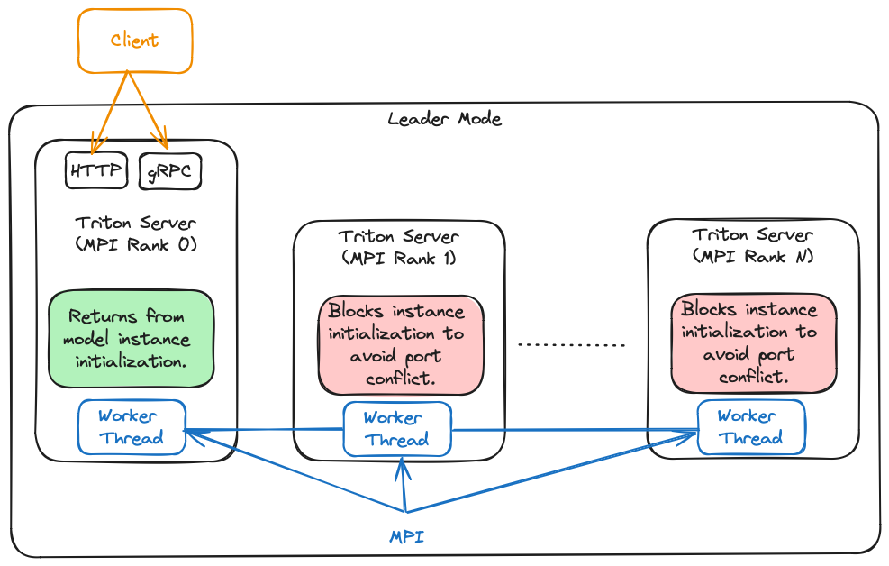
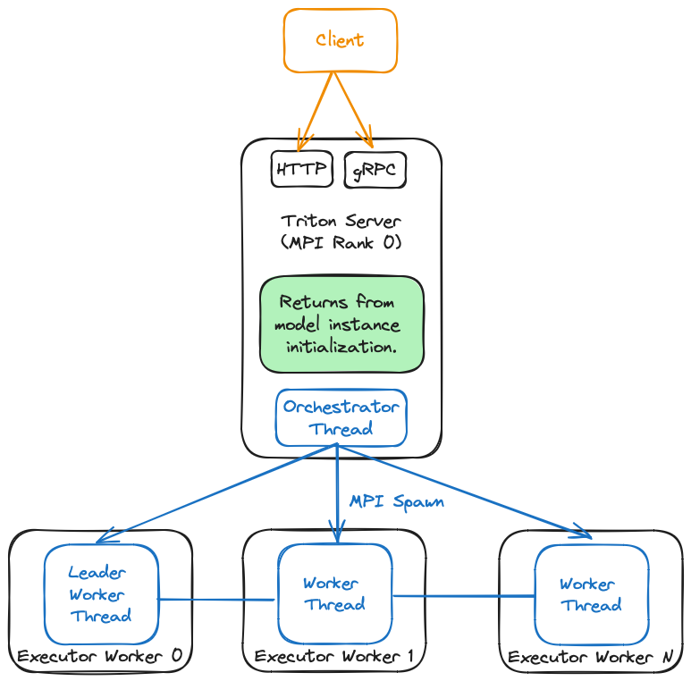

<!--
# Copyright 2024-2026, NVIDIA CORPORATION & AFFILIATES. All rights reserved.
#
# Redistribution and use in source and binary forms, with or without
# modification, are permitted provided that the following conditions
# are met:
#  * Redistributions of source code must retain the above copyright
#    notice, this list of conditions and the following disclaimer.
#  * Redistributions in binary form must reproduce the above copyright
#    notice, this list of conditions and the following disclaimer in the
#    documentation and/or other materials provided with the distribution.
#  * Neither the name of NVIDIA CORPORATION nor the names of its
#    contributors may be used to endorse or promote products derived
#    from this software without specific prior written permission.
#
# THIS SOFTWARE IS PROVIDED BY THE COPYRIGHT HOLDERS ``AS IS'' AND ANY
# EXPRESS OR IMPLIED WARRANTIES, INCLUDING, BUT NOT LIMITED TO, THE
# IMPLIED WARRANTIES OF MERCHANTABILITY AND FITNESS FOR A PARTICULAR
# PURPOSE ARE DISCLAIMED.  IN NO EVENT SHALL THE COPYRIGHT OWNER OR
# CONTRIBUTORS BE LIABLE FOR ANY DIRECT, INDIRECT, INCIDENTAL, SPECIAL,
# EXEMPLARY, OR CONSEQUENTIAL DAMAGES (INCLUDING, BUT NOT LIMITED TO,
# PROCUREMENT OF SUBSTITUTE GOODS OR SERVICES; LOSS OF USE, DATA, OR
# PROFITS; OR BUSINESS INTERRUPTION) HOWEVER CAUSED AND ON ANY THEORY
# OF LIABILITY, WHETHER IN CONTRACT, STRICT LIABILITY, OR TORT
# (INCLUDING NEGLIGENCE OR OTHERWISE) ARISING IN ANY WAY OUT OF THE USE
# OF THIS SOFTWARE, EVEN IF ADVISED OF THE POSSIBILITY OF SUCH DAMAGE.
-->

# TensorRT-LLM Backend
The Triton backend for [TensorRT-LLM](https://github.com/NVIDIA/TensorRT-LLM).
You can learn more about Triton backends in the [backend repo](https://github.com/triton-inference-server/backend).
The goal of TensorRT-LLM Backend is to let you serve [TensorRT-LLM](https://github.com/NVIDIA/TensorRT-LLM)
models with Triton Inference Server. The [inflight_batcher_llm](https://github.com/triton-inference-server/TensorRT-LLM/tree/main/triton_backend/all_models/inflight_batcher_llm)
directory contains the C++ implementation of the backend supporting inflight
batching, paged attention and more.

> [!NOTE]
>
> Please note that the Triton backend source code and test have been moved
> to [TensorRT-LLM](https://github.com/NVIDIA/TensorRT-LLM) under the
> `triton_backend` directory.

Where can I ask general questions about Triton and Triton backends?
Be sure to read all the information below as well as the [general
Triton documentation](https://github.com/triton-inference-server/server#triton-inference-server)
available in the main [server](https://github.com/triton-inference-server/server)
repo. If you don't find your answer there you can ask questions on the
[issues page](https://github.com/triton-inference-server/tensorrtllm_backend/issues).

## Table of Contents
- [TensorRT-LLM Backend](#tensorrt-llm-backend)
  - [Table of Contents](#table-of-contents)
  - [Getting Started](#getting-started)
    - [PyTorch Backend (LLM API) — Recommended](#pytorch-backend-llm-api--recommended)
    - [TensorRT Engine Backend (Legacy)](./docs/README-engine-backend-archive.md)
  - [Building from Source](#building-from-source)
  - [Supported Models](#supported-models)
  - [Model Config](#model-config)
  - [Model Deployment](#model-deployment)
    - [TRT-LLM Multi-instance Support](#trt-llm-multi-instance-support)
      - [Leader Mode](#leader-mode)
      - [Orchestrator Mode](#orchestrator-mode)
      - [Running Multiple Instances of LLaMa Model](#running-multiple-instances-of-llama-model)
    - [Multi-node Support](#multi-node-support)
    - [Model Parallelism](#model-parallelism)
      - [Tensor Parallelism, Pipeline Parallelism and Expert Parallelism](#tensor-parallelism-pipeline-parallelism-and-expert-parallelism)
    - [MIG Support](#mig-support)
    - [Scheduling](#scheduling)
    - [Key-Value Cache](#key-value-cache)
    - [Decoding](#decoding)
      - [Decoding Modes - Top-k, Top-p, Top-k Top-p, Beam Search, Medusa, ReDrafter, Lookahead and Eagle](#decoding-modes---top-k-top-p-top-k-top-p-beam-search-medusa-redrafter-lookahead-and-eagle)
      - [Speculative Decoding](#speculative-decoding)
    - [Chunked Context](#chunked-context)
    - [Quantization](#quantization)
    - [LoRa](#lora)
  - [Launch Triton server *within Slurm based clusters*](#launch-triton-server-within-slurm-based-clusters)
    - [Prepare some scripts](#prepare-some-scripts)
    - [Submit a Slurm job](#submit-a-slurm-job)
  - [Triton Metrics](#triton-metrics)
  - [Benchmarking](#benchmarking)
  - [Testing the TensorRT-LLM Backend](#testing-the-tensorrt-llm-backend)

## Getting Started

### PyTorch Backend (LLM API) — Recommended

Serve any HuggingFace model directly — no engine compilation required.

#### Launch the container

```bash
docker run --rm -it --net host --shm-size=2g --ulimit memlock=-1 --gpus all \
    -v ~/.cache/huggingface:/root/.cache/huggingface \
    nvcr.io/nvidia/tritonserver:25.12-trtllm-python-py3 bash
```

Replace `25.12` with the latest tag from [NGC](https://catalog.ngc.nvidia.com/orgs/nvidia/containers/tritonserver/tags).

#### Clone TRT-LLM and set your model

```bash
git clone https://github.com/NVIDIA/TensorRT-LLM.git
```

Edit `TensorRT-LLM/triton_backend/all_models/llmapi/tensorrt_llm/1/model.yaml`
and set `model:` to any HuggingFace model ID or local path, for example:

```yaml
model: TinyLlama/TinyLlama-1.1B-Chat-v1.0
```

For gated models (e.g. Llama), set your token first: `export HF_TOKEN=hf_...`

#### Launch and test

> [!IMPORTANT]
> Run from the directory where you ran `git clone` (the parent of `TensorRT-LLM/`),
> **not** from inside the `TensorRT-LLM/` folder. Running from inside it causes
> `ModuleNotFoundError: No module named 'tensorrt_llm.bindings'`.

```bash
python3 TensorRT-LLM/triton_backend/scripts/launch_triton_server.py \
    --model_repo=TensorRT-LLM/triton_backend/all_models/llmapi/
```

Once the server is up, send a request:

```bash
curl -X POST localhost:8000/v2/models/tensorrt_llm/generate \
    -d '{"text_input": "The future of AI is", "sampling_param_max_tokens": 50}' | jq
```

For multi-GPU, multi-node, and advanced options see [`docs/llmapi.md`](./docs/llmapi.md).

---

### TensorRT Engine Backend (Legacy)

For workflows using pre-compiled TensorRT engines (`trtllm-build`), refer to the
archived guide: [**docs/README-engine-backend-archive.md**](./docs/README-engine-backend-archive.md)

---

## Building from Source

Please refer to the [build.md](./docs/build.md) for more details on how to
build the Triton TRT-LLM container from source.

## Supported Models

Only a few examples are listed here. For all the supported models, please refer
to the [support matrix](https://nvidia.github.io/TensorRT-LLM/reference/support-matrix.html).

- LLaMa
  - [End to end workflow to run llama 7b with Triton](https://github.com/triton-inference-server/tensorrtllm_backend/blob/main/docs/llama.md)
  - [Build and run a LLaMA model in TensorRT-LLM](https://github.com/NVIDIA/TensorRT-LLM/tree/main/examples/models/core/llama)
  - [Llama Multi-instance](https://github.com/triton-inference-server/tensorrtllm_backend/blob/main/docs/llama_multi_instance.md)
  - [Deploying Hugging Face Llama2-7b Model in Triton](https://github.com/triton-inference-server/tutorials/blob/main/Popular_Models_Guide/Llama2/trtllm_guide.md)

- Gemma
  - [End to end workflow to run sp model with Triton](https://github.com/triton-inference-server/tensorrtllm_backend/blob/main/docs/gemma.md)
  - [Run Gemma on TensorRT-LLM](https://github.com/NVIDIA/TensorRT-LLM/tree/main/examples/models/core/gemma)

- Mistral
  - [Build and run a Mixtral model in TensorRT-LLM](https://github.com/NVIDIA/TensorRT-LLM/blob/main/examples/models/core/mixtral/README.md)

- Multi-modal
  - [End to end workflow to run multimodal models(e.g. BLIP2-OPT, LLava1.5-7B, VILA) with Triton](https://github.com/triton-inference-server/tensorrtllm_backend/blob/main/docs/multimodal.md)
  - [Deploying Hugging Face Llava1.5-7b Model in Triton](https://github.com/triton-inference-server/tutorials/blob/main/Popular_Models_Guide/Llava1.5/llava_trtllm_guide.md)

- Encoder-Decoder
  - [End to end workflow to run an Encoder-Decoder model with Triton](https://github.com/triton-inference-server/tensorrtllm_backend/blob/main/docs/encoder_decoder.md)

## Model Config

Please refer to the [model config](./docs/model_config.md) for more details on
the model configuration.

## Model Deployment

### TRT-LLM Multi-instance Support

TensorRT-LLM backend relies on MPI to coordinate the execution of a model across
multiple GPUs and nodes. Currently, there are two different modes supported to
run a model across multiple GPUs, **Leader Mode** and **Orchestrator Mode**.

> **Note**: This is different from the model multi-instance support from Triton
> Server which allows multiple instances of a model to be run on the same or
> different GPUs. For more information on Triton Server multi-instance support,
> please refer to the
> [Triton model config documentation](https://github.com/triton-inference-server/server/blob/main/docs/user_guide/model_configuration.md#instance-groups).

#### Leader Mode

In leader mode, TensorRT-LLM backend spawns one Triton Server process for every
GPU. The process with rank 0 is the leader process. Other Triton Server processes,
do not return from the `TRITONBACKEND_ModelInstanceInitialize` call to avoid
port collision and allowing the other processes to receive requests.

The overview of this mode is described in the diagram below:



This mode is friendly with [slurm](https://slurm.schedmd.com) deployments since
it doesn't use
[MPI_Comm_spawn](https://www.open-mpi.org/doc/v4.1/man3/MPI_Comm_spawn.3.php).

#### Orchestrator Mode

In orchestrator mode, the TensorRT-LLM backend spawns a single Triton Server
process that acts as an orchestrator and spawns one Triton Server process for
every GPU that each model requires. This mode is mainly used when serving
multiple models with TensorRT-LLM backend. In this mode, the `MPI` world size
must be one as TRT-LLM backend will automatically create new workers as needed.
The overview of this mode is described in the diagram below:



Since this mode uses
[MPI_Comm_spawn](https://www.open-mpi.org/doc/v4.1/man3/MPI_Comm_spawn.3.php),
it might not work properly with [slurm](https://slurm.schedmd.com) deployments.
Additionally, this currently only works for single node deployments.

#### Running Multiple Instances of LLaMa Model

Please refer to
[Running Multiple Instances of the LLaMa Model](docs/llama_multi_instance.md)
for more information on running multiple instances of LLaMa model in different
configurations.

### Multi-node Support

Check out the
[Multi-Node Generative AI w/ Triton Server and TensorRT-LLM](https://github.com/triton-inference-server/tutorials/tree/main/Deployment/Kubernetes/TensorRT-LLM_Multi-Node_Distributed_Models)
tutorial for Triton Server and TensorRT-LLM multi-node deployment.

### Model Parallelism

#### Tensor Parallelism, Pipeline Parallelism and Expert Parallelism

[Tensor Parallelism](https://docs.nvidia.com/nemo-framework/user-guide/latest/nemotoolkit/features/parallelisms.html#tensor-parallelism),
[Pipeline Parallelism](https://docs.nvidia.com/nemo-framework/user-guide/latest/nemotoolkit/features/parallelisms.html#pipeline-parallelism)
and
[Expert parallelism](https://docs.nvidia.com/nemo-framework/user-guide/latest/nemotoolkit/features/parallelisms.html#expert-parallelism)
are supported in TensorRT-LLM.

See the models in the
[examples](https://github.com/NVIDIA/TensorRT-LLM/tree/main/examples) folder for
more details on how to build the engines with tensor parallelism, pipeline
parallelism and expert parallelism.

Some examples are shown below:

- Build LLaMA v3 70B using 4-way tensor parallelism and 2-way pipeline parallelism.

```bash
python3 convert_checkpoint.py --model_dir ./tmp/llama/70B/hf/ \
                            --output_dir ./tllm_checkpoint_8gpu_tp4_pp2 \
                            --dtype float16 \
                            --tp_size 4 \
                            --pp_size 2

trtllm-build --checkpoint_dir ./tllm_checkpoint_8gpu_tp4_pp2 \
            --output_dir ./tmp/llama/70B/trt_engines/fp16/8-gpu/ \
            --gemm_plugin auto
```

- Build Mixtral8x22B with tensor parallelism and expert parallelism

```bash
python3 ../llama/convert_checkpoint.py --model_dir ./Mixtral-8x22B-v0.1 \
                             --output_dir ./tllm_checkpoint_mixtral_8gpu \
                             --dtype float16 \
                             --tp_size 8 \
                             --moe_tp_size 2 \
                             --moe_ep_size 4
trtllm-build --checkpoint_dir ./tllm_checkpoint_mixtral_8gpu \
                 --output_dir ./trt_engines/mixtral/tp2ep4 \
                 --gemm_plugin float16
```

See the
[doc](https://github.com/NVIDIA/TensorRT-LLM/blob/main/docs/source/legacy/advanced/expert-parallelism.md)
to learn more about how TensorRT-LLM expert parallelism works in Mixture of Experts (MoE).

### MIG Support

See the
[MIG tutorial](https://github.com/triton-inference-server/tutorials/tree/main/Deployment/Kubernetes)
for more details on how to run TRT-LLM models and Triton with MIG.

### Scheduling

The scheduler policy helps the batch manager adjust how requests are scheduled
for execution. There are two scheduler policies supported in TensorRT-LLM,
`MAX_UTILIZATION` and `GUARANTEED_NO_EVICT`. You can specify the scheduler
policy via the `batch_scheduler_policy` parameter in the
[model config](./docs/model_config.md#tensorrt_llm-model) of tensorrt_llm model.

### Key-Value Cache

See the
[KV Cache](https://github.com/NVIDIA/TensorRT-LLM/blob/main/docs/source/legacy/advanced/gpt-attention.md#kv-cache)
section for more details on how TensorRT-LLM supports KV cache. Also, check out
the [KV Cache Reuse](https://github.com/NVIDIA/TensorRT-LLM/blob/main/docs/source/legacy/advanced/kv-cache-reuse.md)
documentation to learn more about how to enable KV cache reuse when building the
TRT-LLM engine. Parameters for KV cache can be found in the
[model config](./docs/model_config.md#tensorrt_llm-model) of tensorrt_llm model.

### Decoding

#### Decoding Modes - Top-k, Top-p, Top-k Top-p, Beam Search, Medusa, ReDrafter, Lookahead and Eagle

TensorRT-LLM supports various decoding modes, including top-k, top-p,
top-k top-p, beam search Medusa, ReDrafter, Lookahead and Eagle. See the
[Sampling Parameters](https://github.com/NVIDIA/TensorRT-LLM/blob/main/docs/source/legacy/advanced/gpt-runtime.md#sampling-parameters)
section to learn more about top-k, top-p, top-k top-p and beam search decoding.
Please refer to the
[speculative decoding documentation](https://github.com/NVIDIA/TensorRT-LLM/blob/main/docs/source/legacy/advanced/speculative-decoding.md)
for more details on Medusa, ReDrafter, Lookahead and Eagle.

Parameters for decoding modes can be found in the
[model config](./docs/model_config.md#tensorrt_llm-model) of tensorrt_llm model.

#### Speculative Decoding

See the
[Speculative Decoding](https://github.com/NVIDIA/TensorRT-LLM/blob/main/docs/source/legacy/advanced/speculative-decoding.md)
documentation to learn more about how TensorRT-LLM supports speculative decoding
to improve the performance. The parameters for speculative decoding can be found
in the [model config](./docs/model_config.md#tensorrt_llm_bls-model) of
tensorrt_llm_bls model.

### Chunked Context

For more details on how to use chunked context, please refer to the
[Chunked Context](https://github.com/NVIDIA/TensorRT-LLM/blob/main/docs/source/legacy/advanced/gpt-attention.md#chunked-context)
section. Parameters for chunked context can be found in the
[model config](./docs/model_config.md#tensorrt_llm-model) of tensorrt_llm model.

### Quantization

Check out the
[Quantization Guide](https://github.com/NVIDIA/TensorRT-LLM/blob/main/examples/quantization/README.md)
to learn more about how to install the quantization toolkit and quantize
TensorRT-LLM models. Also, check out the blog post
[Speed up inference with SOTA quantization techniques in TRT-LLM](https://github.com/NVIDIA/TensorRT-LLM/blob/main/docs/source/blogs/quantization-in-TRT-LLM.md)
to learn more about how to speed up inference with quantization.

### LoRa

Refer to [lora.md](./docs/lora.md) for more details on how to use LoRa
with TensorRT-LLM and Triton.

## Launch Triton server *within Slurm based clusters*

### Prepare some scripts

`tensorrt_llm_triton.sub`
```bash
#!/bin/bash
#SBATCH -o logs/tensorrt_llm.out
#SBATCH -e logs/tensorrt_llm.error
#SBATCH -J <REPLACE WITH YOUR JOB's NAME>
#SBATCH -A <REPLACE WITH YOUR ACCOUNT's NAME>
#SBATCH -p <REPLACE WITH YOUR PARTITION's NAME>
#SBATCH --nodes=1
#SBATCH --ntasks-per-node=8
#SBATCH --time=00:30:00

sudo nvidia-smi -lgc 1410,1410

srun --mpi=pmix \
    --container-image triton_trt_llm \
    --container-workdir /tensorrtllm_backend \
    --output logs/tensorrt_llm_%t.out \
    bash /tensorrtllm_backend/tensorrt_llm_triton.sh
```

`tensorrt_llm_triton.sh`
```bash
TRITONSERVER="/opt/tritonserver/bin/tritonserver"
MODEL_REPO="/triton_model_repo"

${TRITONSERVER} --model-repository=${MODEL_REPO} --disable-auto-complete-config --backend-config=python,shm-region-prefix-name=prefix${SLURM_PROCID}_
```

If srun initializes the mpi environment, you can use the following command to launch the Triton server:

```bash
srun --mpi pmix launch_triton_server.py --oversubscribe
```

### Submit a Slurm job

```bash
sbatch tensorrt_llm_triton.sub
```

You might have to contact your cluster's administrator to help you customize the above script.

## Triton Metrics

Starting with the 23.11 release of Triton, users can now obtain TRT LLM Batch
Manager statistics by querying the Triton metrics endpoint. This can be accomplished
by launching a Triton server in any of the ways described above (ensuring the build
code / container is 23.11 or later) and querying the server. Upon receiving a
successful response, you can query the metrics endpoint by entering the following:

```bash
curl localhost:8002/metrics
```

Batch manager statistics are reported by the metrics endpoint in fields that
are prefixed with `nv_trt_llm_`. Your output for these fields should look
similar to the following (assuming your model is an inflight batcher model):

```bash
# HELP nv_trt_llm_request_metrics TRT LLM request metrics
# TYPE nv_trt_llm_request_metrics gauge
nv_trt_llm_request_metrics{model="tensorrt_llm",request_type="waiting",version="1"} 1
nv_trt_llm_request_metrics{model="tensorrt_llm",request_type="context",version="1"} 1
nv_trt_llm_request_metrics{model="tensorrt_llm",request_type="scheduled",version="1"} 1
nv_trt_llm_request_metrics{model="tensorrt_llm",request_type="max",version="1"} 512
nv_trt_llm_request_metrics{model="tensorrt_llm",request_type="active",version="1"} 0
# HELP nv_trt_llm_runtime_memory_metrics TRT LLM runtime memory metrics
# TYPE nv_trt_llm_runtime_memory_metrics gauge
nv_trt_llm_runtime_memory_metrics{memory_type="pinned",model="tensorrt_llm",version="1"} 0
nv_trt_llm_runtime_memory_metrics{memory_type="gpu",model="tensorrt_llm",version="1"} 1610236
nv_trt_llm_runtime_memory_metrics{memory_type="cpu",model="tensorrt_llm",version="1"} 0
# HELP nv_trt_llm_kv_cache_block_metrics TRT LLM KV cache block metrics
# TYPE nv_trt_llm_kv_cache_block_metrics gauge
nv_trt_llm_kv_cache_block_metrics{kv_cache_block_type="fraction",model="tensorrt_llm",version="1"} 0.4875
nv_trt_llm_kv_cache_block_metrics{kv_cache_block_type="tokens_per",model="tensorrt_llm",version="1"} 64
nv_trt_llm_kv_cache_block_metrics{kv_cache_block_type="used",model="tensorrt_llm",version="1"} 1
nv_trt_llm_kv_cache_block_metrics{kv_cache_block_type="free",model="tensorrt_llm",version="1"} 6239
nv_trt_llm_kv_cache_block_metrics{kv_cache_block_type="max",model="tensorrt_llm",version="1"} 6239
# HELP nv_trt_llm_inflight_batcher_metrics TRT LLM inflight_batcher-specific metrics
# TYPE nv_trt_llm_inflight_batcher_metrics gauge
nv_trt_llm_inflight_batcher_metrics{inflight_batcher_specific_metric="micro_batch_id",model="tensorrt_llm",version="1"} 0
nv_trt_llm_inflight_batcher_metrics{inflight_batcher_specific_metric="generation_requests",model="tensorrt_llm",version="1"} 0
nv_trt_llm_inflight_batcher_metrics{inflight_batcher_specific_metric="total_context_tokens",model="tensorrt_llm",version="1"} 0
# HELP nv_trt_llm_general_metrics General TRT LLM metrics
# TYPE nv_trt_llm_general_metrics gauge
nv_trt_llm_general_metrics{general_type="iteration_counter",model="tensorrt_llm",version="1"} 0
nv_trt_llm_general_metrics{general_type="timestamp",model="tensorrt_llm",version="1"} 1700074049
# HELP nv_trt_llm_disaggregated_serving_metrics TRT LLM disaggregated serving metrics
# TYPE nv_trt_llm_disaggregated_serving_metrics counter
nv_trt_llm_disaggregated_serving_metrics{disaggregated_serving_type="kv_cache_transfer_ms",model="tensorrt_llm",version="1"} 0
nv_trt_llm_disaggregated_serving_metrics{disaggregated_serving_type="request_count",model="tensorrt_llm",version="1"} 0
```

If, instead, you launched a V1 model, your output will look similar to the
output above except the inflight batcher related fields will be replaced
with something similar to the following:

```bash
# HELP nv_trt_llm_v1_metrics TRT LLM v1-specific metrics
# TYPE nv_trt_llm_v1_metrics gauge
nv_trt_llm_v1_metrics{model="tensorrt_llm",v1_specific_metric="total_generation_tokens",version="1"} 20
nv_trt_llm_v1_metrics{model="tensorrt_llm",v1_specific_metric="empty_generation_slots",version="1"} 0
nv_trt_llm_v1_metrics{model="tensorrt_llm",v1_specific_metric="total_context_tokens",version="1"} 5
```

Please note that versions of Triton prior to the 23.12 release do not
support base Triton metrics. As such, the following fields will report 0:

```bash
# HELP nv_inference_request_success Number of successful inference requests, all batch sizes
# TYPE nv_inference_request_success counter
nv_inference_request_success{model="tensorrt_llm",version="1"} 0
# HELP nv_inference_request_failure Number of failed inference requests, all batch sizes
# TYPE nv_inference_request_failure counter
nv_inference_request_failure{model="tensorrt_llm",version="1"} 0
# HELP nv_inference_count Number of inferences performed (does not include cached requests)
# TYPE nv_inference_count counter
nv_inference_count{model="tensorrt_llm",version="1"} 0
# HELP nv_inference_exec_count Number of model executions performed (does not include cached requests)
# TYPE nv_inference_exec_count counter
nv_inference_exec_count{model="tensorrt_llm",version="1"} 0
# HELP nv_inference_request_duration_us Cumulative inference request duration in microseconds (includes cached requests)
# TYPE nv_inference_request_duration_us counter
nv_inference_request_duration_us{model="tensorrt_llm",version="1"} 0
# HELP nv_inference_queue_duration_us Cumulative inference queuing duration in microseconds (includes cached requests)
# TYPE nv_inference_queue_duration_us counter
nv_inference_queue_duration_us{model="tensorrt_llm",version="1"} 0
# HELP nv_inference_compute_input_duration_us Cumulative compute input duration in microseconds (does not include cached requests)
# TYPE nv_inference_compute_input_duration_us counter
nv_inference_compute_input_duration_us{model="tensorrt_llm",version="1"} 0
# HELP nv_inference_compute_infer_duration_us Cumulative compute inference duration in microseconds (does not include cached requests)
# TYPE nv_inference_compute_infer_duration_us counter
nv_inference_compute_infer_duration_us{model="tensorrt_llm",version="1"} 0
# HELP nv_inference_compute_output_duration_us Cumulative inference compute output duration in microseconds (does not include cached requests)
# TYPE nv_inference_compute_output_duration_us counter
nv_inference_compute_output_duration_us{model="tensorrt_llm",version="1"} 0
# HELP nv_inference_pending_request_count Instantaneous number of pending requests awaiting execution per-model.
# TYPE nv_inference_pending_request_count gauge
nv_inference_pending_request_count{model="tensorrt_llm",version="1"} 0
```

## Benchmarking

Check out [GenAI-Perf](https://github.com/triton-inference-server/perf_analyzer/tree/main/genai-perf)
tool for benchmarking TensorRT-LLM models.

You can also use the
[benchmark_core_model script](https://github.com/NVIDIA/TensorRT-LLM/blob/main/triton_backend/tools/inflight_batcher_llm/benchmark_core_model.py)
to benchmark the core model `tensosrrt_llm`. The script sends requests directly
to deployed `tensorrt_llm` model. The benchmark core model latency indicates the
inference latency of TensorRT-LLM, not including the pre/post-processing latency
which is usually handled by a third-party library such as HuggingFace.

benchmark_core_model can generate traffic from 2 sources.
1 - dataset (json file containing prompts and optional responses)
2 - token normal distribution (user specified input, output seqlen)

By default, exponential distrution is used to control arrival rate of requests.
It can be changed to constant arrival time.

```bash
cd tools/inflight_batcher_llm
```

Example: Run dataset with 10 req/sec requested rate with provided tokenizer.

```bash
python3 benchmark_core_model.py -i grpc --request_rate 10 dataset --dataset <dataset path> --tokenizer_dir <> --num_requests 5000
```

Example: Generate I/O seqlen tokens with input normal distribution with mean_seqlen=128, stdev=10. Output normal distribution with mean_seqlen=20, stdev=2. Set stdev=0 to get constant seqlens.

```bash
python3 benchmark_core_model.py -i grpc --request_rate 10 token_norm_dist --input_mean 128 --input_stdev 5 --output_mean 20 --output_stdev 2 --num_requests 5000
```

Expected outputs

```bash
[INFO] Warm up for benchmarking.
[INFO] Start benchmarking on 5000 prompts.
[INFO] Total Latency: 26585.349 ms
[INFO] Total request latencies: 11569672.000999955 ms
+----------------------------+----------+
|            Stat            |  Value   |
+----------------------------+----------+
|        Requests/Sec        |  188.09  |
|       OP tokens/sec        | 3857.66  |
|     Avg. latency (ms)      | 2313.93  |
|      P99 latency (ms)      | 3624.95  |
|      P90 latency (ms)      | 3127.75  |
| Avg. IP tokens per request |  128.53  |
| Avg. OP tokens per request |  20.51   |
|     Total latency (ms)     | 26582.72 |
|       Total requests       | 5000.00  |
+----------------------------+----------+

```
*Please note that the expected outputs in that document are only for reference, specific performance numbers depend on the GPU you're using.*

## Testing the TensorRT-LLM Backend
Please follow the guide in [`tensorrt_llm/triton_backend/ci/README.md`](https://github.com/NVIDIA/TensorRT-LLM/blob/main/triton_backend/ci/README.md) to see how to run
the testing for TensorRT-LLM backend.
